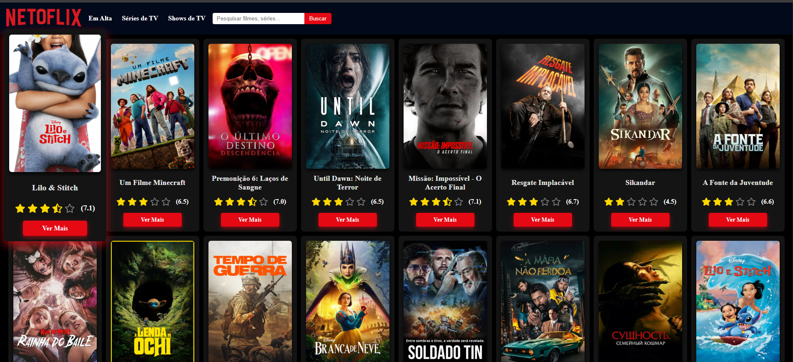
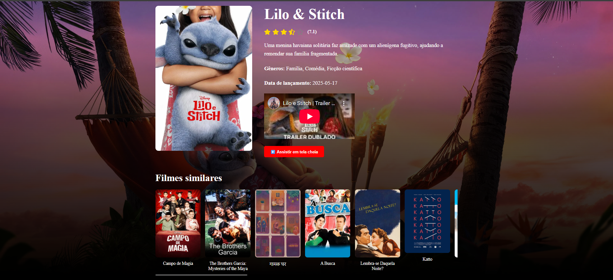

# 🎬 Netoflix Clone - Catálogo de Filmes

Este é um projeto de catálogo de filmes inspirado na interface da Netoflix, desenvolvido com **React** e utilizando a **TMDB API** para consumo de dados de filmes, séries e shows de TV.

## 📸 Preview


Pagina de detalhes


---

## 🚀 Funcionalidades

- 🔍 **Pesquisa de Filmes, Séries e Shows de TV**
- ⭐ **Sistema de Avaliação com Estrelas**
- 📄 **Página de Detalhes de Cada Filme**
- 🔥 **Seção "Em Alta" com os filmes mais populares**
- 📺 **Seção para Séries de TV e Shows**
- 🔄 **Scroll Infinito — Carregamento automático ao descer a página**
- 💡 Layout responsivo e inspirado na Netflix

---

## 🛠️ Tecnologias

- **React**
- **React Router DOM**
- **TMDB API**
- **CSS Puro (customizado e responsivo)**
- **Vite** (build e desenvolvimento mais rápido)

---

## 📦 Instalação

### 🔧 Pré-requisitos

- Node.js (v16 ou superior)
- NPM ou Yarn

### ⚙️ Passos

1. **Clone este repositório:**

```bash
git clone https://github.com/geovane833/netoflix.git
